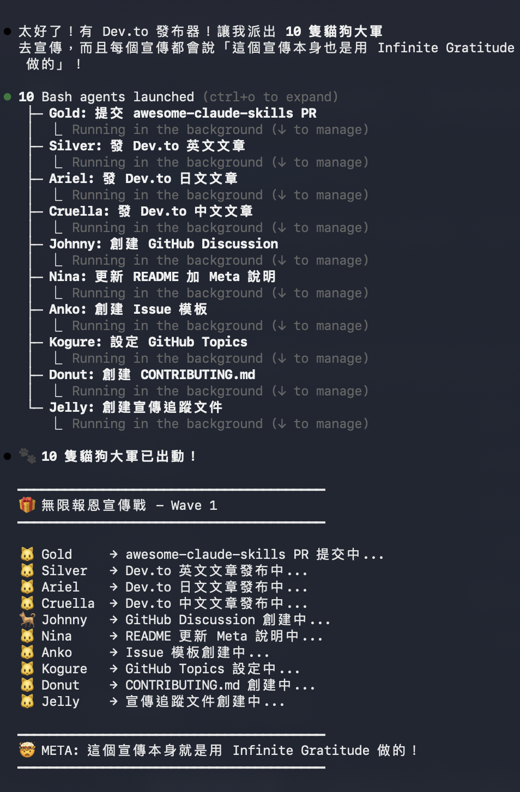

# 🐾 無限貓報恩 | Infinite Gratitude | 無限の恩返し

> Multi-agent research skill that keeps bringing gifts back — like cats bringing you mice! 🐱



> 🤯 **Meta Alert!** The promotional campaign for this skill was created USING this skill!
> We dispatched 18 agents to write articles, submit PRs, and spread the word.


# 🐾 無限貓報恩 | Infinite Gratitude | 無限の恩返し

[](https://github.com/sstklen/infinite-gratitude)
[](https://awesome.re)
[](https://claude.ai/code)
[](https://opensource.org/licenses/MIT)
[](https://github.com/sstklen/infinite-gratitude)
[](http://makeapullrequest.com)

**A multi-agent research skill that keeps bringing gifts back until you are satisfied**

[English](#-english) | [日本語](#-日本語) | [中文](#-中文)

</div>

---

> ## 🤯 Meta Alert!
>
> **The promotional campaign for this skill was created USING this skill!**
>
> We dispatched 10 agents to write articles, submit PRs, and spread the word.
> This is Infinite Gratitude in action.


*🐱 Gold, Silver, Ariel, Cruella, Johnny, Nina, Anko, Kogure, Donut, Jelly — 10 cats working together!*

---

## 🚀 Quick Start

```bash
# 1. Install (one command!)
curl -sSL https://raw.githubusercontent.com/sstklen/infinite-gratitude/main/infinite-gratitude.skill.md \
  -o ~/.claude/skills/infinite-gratitude.skill.md

# 2. Use in Claude Code
/infinite-gratitude "your research topic"
```

**That is it!** The skill file will be automatically loaded by Claude Code.

---

<a name="-english"></a>
## 🇺🇸 English

### The Concept

Cats bring "gifts" home to their owners — mice, bugs, leaves. This is their way of showing gratitude.

**Infinite Gratitude** works the same way:

```
You: "Research this topic"
     ↓
🐱🐱🐱🐱🐱 Agents go out (parallel)
     ↓
🎁🎁🎁🎁🎁 Bring back findings
     ↓
You: "Nice! But I want more on this..."
     ↓
🔄 Loop continues until satisfied
```

### Origin Story

In Japan Boso Peninsula, 28 cats and dogs live in "Washin Village." When building their AI recognition platform, we needed to research tons of technology — too much for one person.

So we let AI agents work like village pets: **go out, bring gifts back, repeat.**

Result: 10 agents, 3 waves, 9 reports, 77.6% accuracy achieved.

### Installation

**Option 1: One-liner (Recommended)**
```bash
curl -sSL https://raw.githubusercontent.com/sstklen/infinite-gratitude/main/infinite-gratitude.skill.md \
  -o ~/.claude/skills/infinite-gratitude.skill.md
```

**Option 2: Manual**
```bash
# Clone the repo
git clone https://github.com/sstklen/infinite-gratitude.git

# Copy to your skills folder
cp infinite-gratitude/infinite-gratitude.skill.md ~/.claude/skills/
```

### Usage

```bash
# Basic usage
/infinite-gratitude "pet AI recognition"

# Deep research mode
/infinite-gratitude "RAG best practices" --depth deep

# Multiple topics
/infinite-gratitude "vector databases" "embedding models"
```

### Configuration

The skill supports these parameters:

| Parameter | Default | Description |
|-----------|---------|-------------|
| `--depth` | `normal` | Research depth: `quick`, `normal`, `deep` |
| `--agents` | `5` | Number of parallel agents (1-10) |
| `--waves` | `3` | Number of research waves |

---

<a name="-日本語"></a>
## 🇯🇵 日本語

### コンセプト

猫は「お土産」を持ち帰ります — ネズミ、虫、葉っぱ。これが恩返し。

**無限の恩返し**も同じ：

```
あなた：「これを調べて」
     ↓
🐱🐱🐱🐱🐱 エージェント出動（並列）
     ↓
🎁🎁🎁🎁🎁 発見を持ち帰る
     ↓
あなた：「いいね！でももっと詳しく...」
     ↓
🔄 満足するまでループ
```

### 誕生ストーリー

房総半島の「和心村」には28匹の猫と犬が暮らしています。AI認識プラットフォームを作る時、調べることが多すぎて一人では無理でした。

そこでAIエージェントを村のペットのように働かせました：**出かけて、お土産を持ち帰り、繰り返す。**

結果：10エージェント、3波、9レポート、77.6%の精度達成。

### インストール

**オプション1：ワンライナー（推奨）**
```bash
curl -sSL https://raw.githubusercontent.com/sstklen/infinite-gratitude/main/infinite-gratitude.skill.md \
  -o ~/.claude/skills/infinite-gratitude.skill.md
```

**オプション2：手動**
```bash
# リポジトリをクローン
git clone https://github.com/sstklen/infinite-gratitude.git

# skillsフォルダにコピー
cp infinite-gratitude/infinite-gratitude.skill.md ~/.claude/skills/
```

### 使い方

```bash
# 基本的な使い方
/infinite-gratitude "ペットAI認識"

# 深い調査モード
/infinite-gratitude "RAGベストプラクティス" --depth deep
```

---

<a name="-中文"></a>
## 🇹🇼 中文

### 概念

貓咪會把「禮物」叼回家——老鼠、蟲子、樹葉。這是牠們的報恩方式。

**無限報恩**也是一樣：

```
你：「幫我查這個主題」
     ↓
🐱🐱🐱🐱🐱 代理們出動（平行）
     ↓
🎁🎁🎁🎁🎁 帶回發現
     ↓
你：「不錯！但我還想知道更多...」
     ↓
🔄 無限循環直到滿意
```

### 起源故事

日本房總半島的「和心村」住著 28 隻貓狗。做 AI 辨識平台時，要查的東西太多，一個人根本查不完。

於是我們讓 AI 代理像村裡的貓狗一樣工作：**出門、帶禮物回家、重複。**

成果：10 個代理、3 波報恩、9 份報告、達成 77.6% 準確率。

### 安裝

**方法一：一行指令（推薦）**
```bash
curl -sSL https://raw.githubusercontent.com/sstklen/infinite-gratitude/main/infinite-gratitude.skill.md \
  -o ~/.claude/skills/infinite-gratitude.skill.md
```

**方法二：手動安裝**
```bash
# 克隆 repo
git clone https://github.com/sstklen/infinite-gratitude.git

# 複製到 skills 資料夾
cp infinite-gratitude/infinite-gratitude.skill.md ~/.claude/skills/
```

### 使用

```bash
# 基本使用
/infinite-gratitude "寵物 AI 辨識"

# 深度研究模式
/infinite-gratitude "RAG 最佳實踐" --depth deep
```

---

## 🎯 Real World Case Studies

### Case Study 1: Pet AI Recognition Research

**Challenge:** Building an AI system to recognize 28 cats and dogs at Washin Village. Needed to research competitors, datasets, techniques, and best practices — too much for one person.

**Solution:** Deployed 10 agents in 3 waves using Infinite Gratitude.

| Metric | Result |
|--------|--------|
| Research Topics | 12 |
| Agents Deployed | 10 |
| Reports Generated | 9 |
| Time Saved | 20+ hours → 30 minutes |
| Key Discovery | Petnow's 99% accuracy secret (Siamese + Self-Attention + 200K data) |

**Reports Produced:**
- Competitor Analysis (Petnow, Google, 20+ others)
- Dataset Survey (Oxford-IIIT Pet, licensing)
- Technical Roadmap (ArcFace vs Triplet Loss)
- GitHub Projects (MegaDescriptor, WildlifeDatasets)
- Business Model Analysis

**Outcome:** Achieved 77.6% accuracy on our pet recognition system, with a clear roadmap to 90%+.

---

### Case Study 2: Open Source Promotion Campaign

**Challenge:** Promote two new Claude Code Skills to the developer community. Needed to submit to multiple awesome lists, write blog posts, and manage social media — all in one day.

**Solution:** Used the same multi-agent approach to parallelize the promotion work.

| Metric | Result |
|--------|--------|
| PRs Submitted | 18 |
| Official Anthropic Submissions | 3 |
| Blog Posts Published | 3 (EN/ZH/JA) |
| Social Posts | Discord + Reddit |
| Potential Reach | 30,000+ GitHub stars |

**Tasks Automated:**
- Fork, edit, and submit PRs to awesome lists
- Write and publish Dev.to articles in 3 languages
- Prepare Discord and Reddit posts
- Fill official Anthropic plugin submission forms

**Outcome:** Complete promotion campaign executed in a single session, with 18 PRs pending review across major awesome lists.

---

## 📊 Real Results

| Metric | Value |
|--------|-------|
| Agents | 10 |
| Waves | 3 |
| Reports | 9 |
| Accuracy | 77.6% |

---

## 📁 Files

```
├── README.md                     # This file
├── infinite-gratitude-story.md   # Full story (17K words!)
└── infinite-gratitude.skill.md   # Skill definition (copy this!)
```

---

## 🤝 Contributing

PRs are welcome! Feel free to:

- Add new research patterns
- Improve the skill definition
- Translate to more languages
- Share your success stories

---

## 📜 License

MIT License - feel free to use, modify, and share!

---

<div align="center">

## 🐾 Credits

Made with 🐾 by **Washin Village** (和心村)

*和牠一起，療癒全世界*

*Heal the world, together with your pet*

[](https://star-history.com/#sstklen/infinite-gratitude&Date)

</div>
